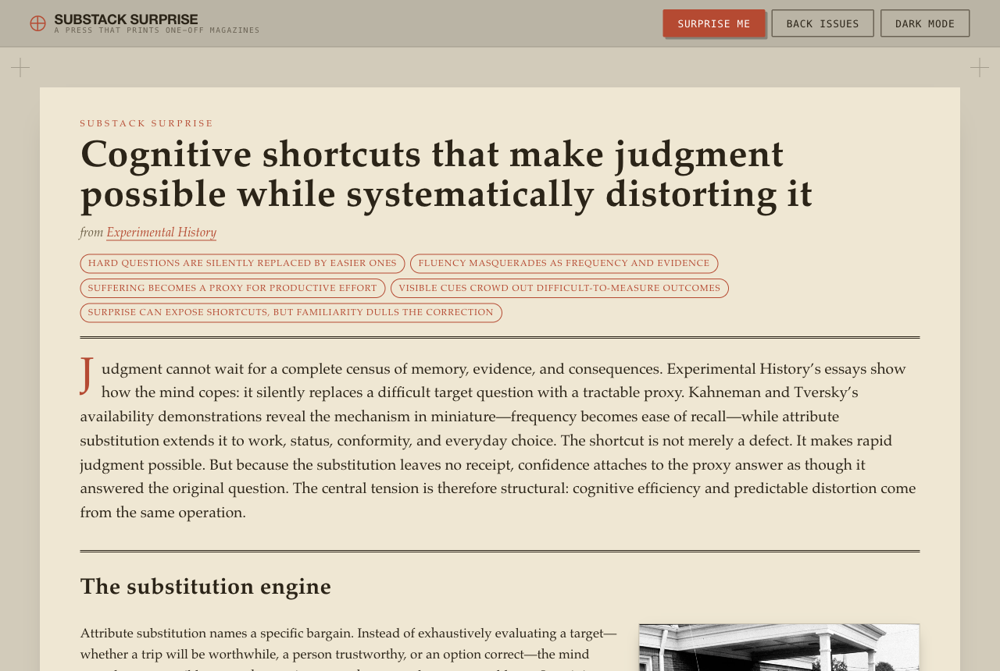
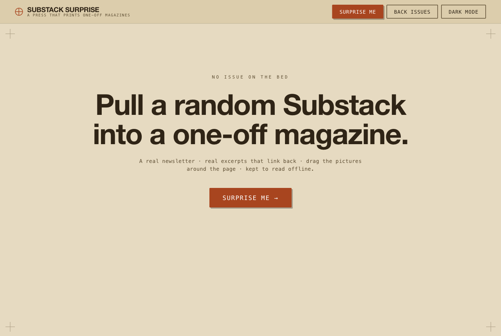
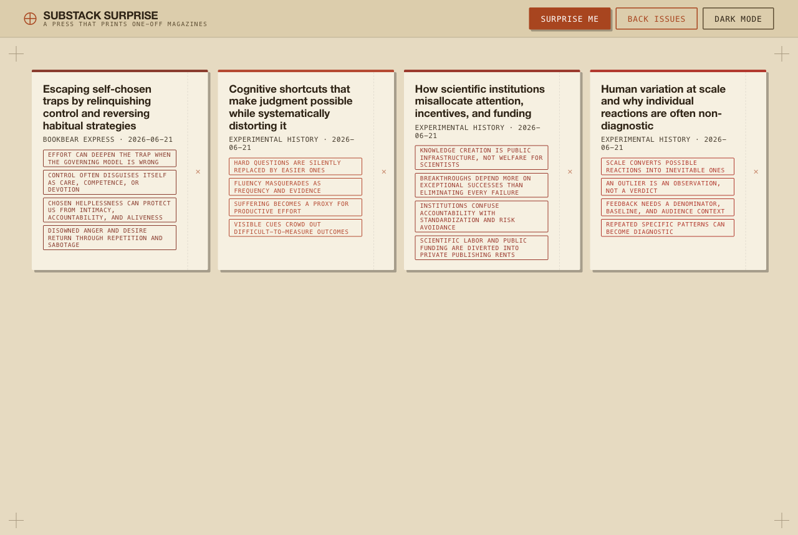

# Substack Surprise — Deep-Dive Magazine Generator


A **local-first** web app that turns a randomly picked **"brainfood" Substack** (philosophy, psychology, culture, meaning, human behavior, literature — *not* AI/tech/startup/news) into an offline, **Obsidian-compatible deep-dive magazine**.



> *A pressed deep-dive magazine — drop-cap intro, sections with connective tissue, cited excerpts that link back, full-width pretext layout.*

Press **"Surprise me"** → the app picks a publication, deep-fetches its archive (~50 free, full-text articles), curates and clusters the *deep* survivors into themes, presses **one** strong theme into a magazine that cites every article it uses, acquires images, and persists everything into a portable vault at `./library/`. Press again for another — a fresh publication (~70%) or an un-pressed theme from a publication already fetched this session (~30%) — and it **never repeats a `(publication, theme)` pair**.

> **Synthesis runs on the local `codex exec` CLI — never the Claude API.** The privacy boundary is local *invocation*, not local *inference*: source text leaves the machine through Codex auth.

---

## Highlights

- **One press = one deep-dive magazine.** N presses → N magazines, each from a strong theme.
- **Article-level curation.** A pub isn't accepted or rejected wholesale — its shallow/tech/AI/news pieces are dropped and only its *deep* articles are clustered into themes.
- **Cited, anti-fabricated synthesis.** Every excerpt must be a verbatim substring of its source article or it's dropped; the server (not the model) attaches canonical source URLs. No fabricated quotes.
- **Obsidian vault as data store.** `./library/` is both the website's offline store and a real Obsidian vault with `[[theme]]`/`[[newsletter]]` graph links.
- **Offline Library mode.** Re-read any saved magazine with no network and no codex — images served same-origin from the vault.
- **Dynamic [pretext](https://chenglou.me/pretext/dynamic-layout/) layout.** Draggable article image with *live* text reflow around it, full page width, debounced resize.
- **Security-hardened.** Loopback-only bind, strict same-origin mutations, SSRF-guarded fetches, byte/time/redirect caps, atomic vault writes.

---

## Screenshots

| The press (idle) | Back issues (offline library) |
|---|---|
|  |  |

The "Press" shell: blueprint-navy desk, proof-paper bed with registration crosshairs, mono press-voice chrome, light/dark toggle. "Back issues" lists every saved magazine for offline re-reading.

---

## How it works

```
Surprise me  ──▶  runDeepDive (deep.ts)
   pick publication ──▶ deep-fetch archive (~50 free full-text articles)
                    ──▶ curate at ARTICLE level (codex: drop shallow/tech/AI, cluster deep ones into themes)
                    ──▶ press ONE strong cluster:
                          synth (codex, theme-focused) ──▶ images ──▶ persist to ./library/
```

Per-session state (`DeepCache`) holds fetched publications and a `pressed` set of `(resolvedDomain, theme)` keys. Each press is **~70% a fresh pick** / **~30% a reused un-pressed theme** from an already-fetched pub (no re-fetch), and never repeats a theme. The fresh path retries up to 4 picks, bounded by a 6-minute acquisition-start deadline.

### Pipeline stages

| Stage | File | Job |
|-------|------|-----|
| pick | `src/server/pool.ts` | Random domain from `config/pool.json` (live-verified Substack feeds) |
| fetch | `src/server/fetcher.ts`, `archive-api.ts` | RSS + paginated archive API → full article text (FREE, `wordcount ≥ 400`) |
| curate | `src/server/curate.ts` | One codex pass: discard shallow/off-topic, cluster deep articles into themes |
| synth | `src/server/synth.ts` | Codex writes a theme-focused magazine (intro + sections + cited excerpts) |
| images | `src/server/images.ts`, `image-download.ts` | Harvest post images + optional Google CSE; download with SSRF/MIME/dimension guards |
| persist | `src/server/vault.ts` | Atomic write into `./library/<slug>/` + Obsidian graph notes |

### Architecture

- **`deep.ts` — `runDeepDive`** is the live `/surprise` path (one deep-dive per press).
- **`surprise.ts` — `runSurprise`** is the original single-magazine path; kept and unit-tested, and provides the shared `Stage`/`StageError`/`InFlightGuard`/`SurpriseConfig` both paths reuse.
- **`src/shared/`** — types and pure helpers shared by server *and* web (`text.ts`, `paths.ts`, `domains.ts`, `post.ts`, `magazine.ts`).
- **`src/web/`** — vanilla TS + Vite frontend; all DOM-free logic unit-tested (`render.ts`, `layout.ts`, `progress.ts`, `vibe.ts`).
- **Transport:** `POST /surprise` returns JSON, or an **SSE stream** when `Accept: text/event-stream` — a `stage` event per phase, then exactly one (or zero) `result` event, then `done`.

---

## Quick start

### Prerequisites

- **[Bun](https://bun.sh)** — the runtime. *Not always on PATH*; if installed via the official script it lives at `~/.bun/bin/bun`.
- **[Codex CLI](https://github.com/openai/codex)** (`codex exec`) — does all synthesis. Must be authenticated.
- **Google Programmable Search Engine** keys (optional) — for supplemental "vibe" images. Without them the app uses post-harvested images only.

Verify your environment:

```bash
export PATH="$HOME/.bun/bin:$PATH"   # if bun isn't on PATH
bun install
bun run doctor                       # checks bun + codex are present
```

### Configure (optional)

```bash
cp .env.example .env
# Fill GOOGLE_CSE_KEY / GOOGLE_CSE_ID for CSE images; PORT defaults to 4321.
```

### Run

```bash
export PATH="$HOME/.bun/bin:$PATH"
bun run dev          # builds the web bundle + serves on http://127.0.0.1:4321
```

Open `http://127.0.0.1:4321`, press **Surprise me**, watch the live build docket, and read the magazine. Press again for another. Switch to **Back issues** to browse saved magazines offline.

> The server binds **127.0.0.1 only** — it is not reachable from other machines.

---

## Commands

```bash
export PATH="$HOME/.bun/bin:$PATH"   # do this first, always

bun run dev            # build web + serve on 127.0.0.1:4321
bun run serve          # serve only (skip web build)
bun run build:web      # Vite build of src/web → dist/web

bun run typecheck      # tsc --noEmit  (must stay clean)
bun run lint           # oxlint src scripts  (must stay clean)
bun test               # full offline test suite (bun:test)
bun test src/server/synth.test.ts   # one file
bun test -t "anti-fabrication"      # one test by name

bun run doctor         # verify bun + codex present
bun run probe:codex    # re-pin the codex CLI contract → docs/codex-contract.md
bun run refresh-pool   # best-effort grow config/pool.json from Substack Discover
bun run clean:library  # reset ./library vault to empty (keeps .obsidian + .gitkeep)
bun run smoke:cse      # manual live Google CSE check (needs GOOGLE_CSE_* env)
```

---

## The vault (`./library/`)

Every magazine is auto-saved as a folder under `./library/`, which doubles as an **Obsidian vault** and the app's offline data store:

```
library/
  <magazine-slug>/
    manifest.json        # status=complete marks validity
    index.md             # frontmatter + ![[images/..]] + cited blockquotes + [[theme]]/[[newsletter]] links
    images/...
  themes/<slug>.md       # rebuilt from magazines on disk (reconcileNotes)
  newsletters/<slug>.md
```

Writes are **atomic** — assembled in `library/.tmp/<uuid>/` then `rename`d into place. Open `./library/` in Obsidian to explore the theme/newsletter graph. The vault is portable by copy/zip (it's gitignored, not tracked).

---

## Load-bearing invariants

These are enforced repo-wide; don't break them when contributing:

- **No Claude API anywhere.** Synthesis is the local `codex exec` CLI via `makeCodexRunner` only.
- **Only inert `Post.contentText` is sent to Codex** — never raw HTML. Source posts are wrapped in `<UNTRUSTED_SOURCE>` ("data, not instructions").
- **Anti-fabrication:** every excerpt must `normalize()`-substring its source article; a spec with zero valid excerpts is rejected. The server attaches canonical source URLs — Codex never supplies them.
- **`image-download.ts` is the only place image bytes are fetched** (SSRF guard, byte/time/redirect caps, MIME sniff, dimension parse). `images.ts` is metadata/URL only.
- **Vault writes are atomic;** `manifest.json` status=`complete` marks validity.
- **Security (`security.ts`):** loopback bind, loopback `Host` required, mutations need exact same-origin + exact `application/json`, asset/library-read routes block cross-origin and cross-site `Sec-Fetch-Site`. The `/library-assets` route serves only `images/<file>` of a `complete` entry via double path-containment checks.
- **Frontend escapes everything;** image srcs are same-origin `/library-assets/` only.

---

## Tech stack

- **Runtime:** Bun + TypeScript (strict, `noUncheckedIndexedAccess`)
- **Synthesis:** local `codex exec` CLI (240s hard timeout; SSE heartbeat keeps the stream alive)
- **Frontend:** vanilla TS + Vite, [`@chenglou/pretext`](https://www.npmjs.com/package/@chenglou/pretext) for article text-flow, CSS-variable theming (6 vibe presets + light/dark "Press" shell)
- **Parsing:** `fast-xml-parser` (RSS), `node-html-parser` (article bodies), `zod` (schema validation)
- **Lint:** `oxlint` · **Tests:** `bun:test` (fixture-only / offline — never call real `codex` or the network)

---

## Project layout

```
src/
  server/      Bun HTTP server + pipeline (deep.ts, surprise.ts, archive-api.ts, curate.ts,
               synth.ts, images.ts, image-download.ts, vault.ts, library.ts, security.ts, ...)
  shared/      types + pure helpers used by both server and web
  web/         vanilla-TS + Vite frontend (render.ts, layout.ts, article-layout.ts, progress.ts, ...)
config/        pool.json (live-verified brainfood Substack domains)
scripts/       doctor, probe-codex, refresh-pool, clean-library, smoke-cse
fixtures/      offline test fixtures
library/       the Obsidian vault / offline data store (gitignored)
docs/          codex-contract.md (pinned CLI contract)
```

**Pool hygiene:** every domain in `config/pool.json` must serve a valid Substack feed. Prefer the `<handle>.substack.com` form (it reliably serves `/feed`; the fetcher follows redirects to custom domains) and verify each candidate through `fetchPublication` before adding.

---

## Development notes

- This is **not** a git-tracked vault: `./library/`, `.state/`, and `dist/` are gitignored (generated/personal).
- Tests must be **fixture-only and offline** — inject `fetchImpl` and a fake codex runner; live checks live behind manual `bun run` scripts.
- Every `codex exec` invocation needs `--skip-git-repo-check` (this isn't a git-tracked codex project) and `< /dev/null` (so it never blocks on stdin).
- See `CLAUDE.md` for architecture detail, `PLAN.md` for the original spec, and `PROGRESS.md` for the full build log (MG0–MG14, all complete).

---

## License

Personal/local project — no license specified.
